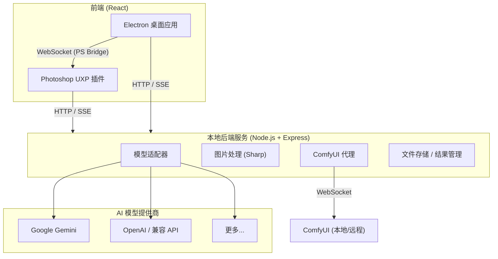

<p align="center">
  
</p>

<h1 align="center">AI Retouch</h1>

<p align="center">
  <strong>比原生更好用的 Photoshop AI 修图插件</strong>
</p>

<p align="center">
  <a href="#简介">简介</a> •
  <a href="#什么是-ai-retouch">什么是 AI Retouch</a> •
  <a href="#我们的愿景">我们的愿景</a> •
  <a href="#为什么选择-ai-retouch">为什么选择 AI Retouch</a> •
  <a href="#安装">安装</a> •
  <a href="#许可证与致谢">许可证与致谢</a>
</p>

---

## 简介

AI Retouch 是一个开源的 Photoshop AI 修图插件，旨在提供比 Adobe 原生功能和市面早期插件**更好的使用体验**。

通过本地后端代理，AI Retouch 让你自由接入各种 AI 大模型 — 用自然语言描述修图需求，AI 直接在你的画布上生成结果。无论是去除杂物、替换背景、生成特效，还是结合 ComfyUI 执行专业级工作流，体验都更流畅、更灵活、更可控。

> 本项目目前处于 **相对较早期** 阶段，核心功能可用但仍在积极开发中。

---

## 什么是 AI Retouch

AI Retouch 是一个运行在 Photoshop 旁边的 AI 修图助手。它在你的电脑上启动一个本地后端服务，将你在 PS 中打开的画布或选区自动提取出来，发送给你配置好的 AI 模型（Gemini、OpenAI 或任何兼容的 API），然后把 AI 生成的图片直接放回 PS 画布的正确位置。

整个过程就像在和 AI 对话 — 你用自然语言说"把天空里的电线去掉"或者"给这个人物加上水彩风格"，AI 返回修改后的图片，不满意就继续迭代。你也可以接入本地的 ComfyUI，在插件里直接选择工作流、调节参数、执行任务。

它有两种使用形态：嵌入 PS 内部的 UXP 插件面板，以及独立运行的 Electron 桌面应用（通过 WebSocket 桥接与 PS 通信）。

---

## 我们的愿景

Adobe 原生的 AI 功能受限于自家模型，早期的第三方插件体验粗糙且往往绑定单一服务商。我们相信 AI 修图可以做得更好。

AI Retouch 想要成为一个**体验更好、更开放的选择** — 让任何 AI 模型都能无缝融入你最熟悉的 Photoshop 工作流，同时提供精心打磨的交互体验。

- **体验优先** — 精心设计的 UI 与交互细节，不是简单的 API 调用包装
- **模型无关** — 不绑定特定提供商，自由接入 Gemini、OpenAI、本地模型或任何兼容 API
- **本地优先** — 后端运行在你的机器上，API Key 不经过第三方
- **深度整合** — 不只是生图，而是融入 PS 画布的提取 → 生成 → 回写全链路
- **社区驱动** — 以 AGPL-3.0 开源，欢迎一切形式的贡献

---

## 为什么选择 AI Retouch

### 真正的多轮对话修图，而不是一次性生成

新一代大模型生图模型（如 Nano Banana）与传统 Stable Diffusion 系模型有本质区别：它们天生支持多轮对话、理解上下文、能在前一张图的基础上持续修改。然而 PS 原生 AI 体验和市面上大多PS AI修图插件仍然沿用传统 SD 时代的工作模式 — 输入一次提示词 → 生成一张图 → 结束。这在 传统模型 上没问题，但**把新世代大模型当成传统模型来用，是对其能力的巨大浪费**。

AI Retouch 为这些新模型而生。我们基于模型官方 SDK 构建了**原生的多轮对话**，让你可以像和人对话一样逐步迭代修图结果 — "先去掉电线"、"把天空颜色调暖一点"、"再加一些云彩"。

这不仅仅是 UI 上的多轮 — 我们在后端完整维护了对话上下文：

- **图像上下文保持**：每一轮对话中模型看到的图片都作为上下文传递给下一轮，模型能理解你之前做了哪些修改，而不是每次都"失忆重来"
- **思维链签名 (Thought Signature) 保持**：对于 Gemini 等模型，AI 在生图时会产生内部推理链（思维链）。Google 官方文档指出，在多轮对话中**必须将思维链签名完整回传**给模型，才能保持其推理的连贯性和生成的一致性。我们的后端逐 part 保存并精确重建这些签名，确保模型在后续轮次中保持稳定的理解和风格
- **对话树分支**：对话不是线性列表而是一棵树。对任何一轮结果不满意，可以回溯到那个节点、创建新分支尝试不同方向，而不丢失已有的其他探索

这意味着你在 AI Retouch 里的修图体验和在其他插件中有本质区别：不是每次扔一个提示词碰运气，而是和 AI 持续协作、逐步逼近理想结果。

### 把 ComfyUI 带进 Photoshop

ComfyUI 是目前最强大的 AI 图像工作流引擎，但它和 Photoshop 之间一直缺少一座好用的桥。传统做法是在两个界面之间反复切换、手动导入导出图片。

AI Retouch 的 ComfyUI 集成让你**在插件内部**完成绝大部分操作：

- 自动解析工作流 JSON 中的每一个节点，生成对应的参数编辑面板（滑块、输入框、下拉选项等）
- 一键将 PS 画布 / 选区发送为 ComfyUI 输入图，执行结果自动回传到结果库
- 不再需要离开 Photoshop 就能使用 ComfyUI 的强大工作流

### 自由选择你的 AI

不绑定任何一家模型提供商。你可以同时配置 Google Gemini、OpenAI、第三方兼容 API 或本地部署的模型，随时切换：

- 支持 `Gemini`、`OpenAI Chat Completions`、`OpenAI Responses` 三种 API 协议
- 多 API Key 轮询 / 降级策略
- 丰富的高级参数控制（Temperature、Top-P/K、Thinking Level、Image Size 等）
- 所有 API Key 仅保存在本地，不经过任何第三方服务器

### Agent 模式 — 即将到来

我们下一阶段的开发重点是 **Agent 系统**。

当前的直接生图模式已经可以完成"你说 → AI 画"的核心流程，但修图创作中有大量任务不止于生成一张图。我们正在构建一套 Agent 框架，让大模型不仅仅是你的画笔，更是你的创作助手：

- **智能调参** — Agent 帮你分析 ComfyUI 工作流，自动调整节点参数、优化提示词
- **信息检索** — 创作过程中需要参考图？Agent 帮你搜索互联网，找到合适的参考素材
- **多步骤编排** — Agent 可以串联多个工具完成复杂任务：搜索参考 → 生成图片 → 用 ComfyUI 放大 → 应用到画布
- **创作辅助** — 从风格建议到构图分析，让 AI 成为你创作流程中的全方位伙伴

---

## 架构



### 技术栈

| 层 | 技术 |
|---|---|
| 包管理 | pnpm workspace (monorepo) |
| 后端 | Node.js, Express, TypeScript, Sharp, WebSocket |
| 前端 | React, TypeScript, CSS, framer-motion, i18next |
| UXP 插件构建 | Vite + esbuild |
| Electron 构建 | electron-vite + electron-builder |
| AI SDK | `@google/genai`, `openai` |
| 数据存储 | JSON 文件 (providers, settings, sessions) |

---

## 安装

### 工作原理

AI Retouch 由两部分组成，**都需要安装**才能正常工作：

1. **桌面应用 (Electron)** — 提供主界面和后端服务。启动桌面应用时，本地后端会自动随之启动，无需单独配置
2. **Photoshop UXP 插件** — 安装在 PS 内部，负责与 Photoshop 进行图层提取、结果回写等交互。桌面应用通过 WebSocket 桥接与此插件通信

> 简单来说：桌面应用是你的操作界面 + AI 大脑，UXP 插件是 Photoshop 里的"手"。两者缺一不可。

### 从 Release 安装

前往 [Releases](https://github.com/N0VAN0M4LY/AI-Retouch/releases) 下载最新的安装包：
- **Windows**: `AI-Retouch-x.x.x-Setup.exe`
- **macOS**: 计划中

安装桌面应用后：
1. 启动 AI Retouch 桌面应用
2. 进入 **设置**，点击 **一键安装插件到 Photoshop**（或手动将附带的 `.ccx` 插件包导入 PS）
3. 在 Photoshop 中启用 AI Retouch 插件
4. 按照引导向导配置你的 AI 模型提供商，即可开始使用

### 从源码构建

#### 环境要求

- **Node.js** ≥ 18
- **pnpm** ≥ 9（`corepack enable && corepack prepare pnpm@9 --activate`）
- **Adobe Photoshop** 2022+（需要能够支持 UXP 插件）

#### 克隆与安装依赖

```bash
git clone https://github.com/N0VAN0M4LY/AI-Retouch.git
cd ai-retouch
pnpm install
```

#### 开发模式

```bash
# 启动后端服务（默认监听 http://127.0.0.1:5341）
pnpm dev:server

# 启动 Electron 桌面应用（含热重载）
pnpm dev:electron

# 或构建 UXP 插件加载到 Photoshop
pnpm build:plugin
# 在 Photoshop UXP Developer Tool 中加载 apps/plugin/dist/manifest.json
```

#### 一键打包

```bash
# Windows 安装包
pnpm pack:win
# 产物位于 apps/electron/release/

# macOS 安装包
pnpm pack:mac
```

#### 配置模型提供商

1. 启动应用后进入 **设置 → 模型提供商**
2. 添加你的 AI 提供商（填入 Base URL、API Key、选择 API 协议）
3. 添加模型（手动填写或从 API 拉取模型列表）
4. 回到对话 Tab 选择模型即可开始使用

---

## 开发路线

已完成：
- [x] Monorepo 基础架构
- [x] 后端基础设施（提供商/设置/路由）
- [x] 直接生图对话模式（多轮 + 流式）
- [x] PS 图层提取与结果回写
- [x] 对话树（分支 / 重新生成）
- [x] 结果库 + 结果抽屉
- [x] ComfyUI 集成（工作流浏览 / 参数 / 队列）
- [x] Electron 桌面应用 + PS 桥接
- [x] Windows 安装包构建

计划中：
- [ ] Agent 模式（LLM 自主调用工具链）
- [ ] 实时ComfyUI任务队列监控（进度、当前节点、耗时估算）
- [ ] macOS 安装包构建
- [ ] 更多语言支持

---

## 贡献

欢迎提交 Issue 和 Pull Request！

---

## 许可证与致谢

本项目基于 [GNU Affero General Public License v3.0 (AGPL-3.0)](https://www.gnu.org/licenses/agpl-3.0.html) 许可证开源。

Copyright © 2026 AI Retouch Contributors
